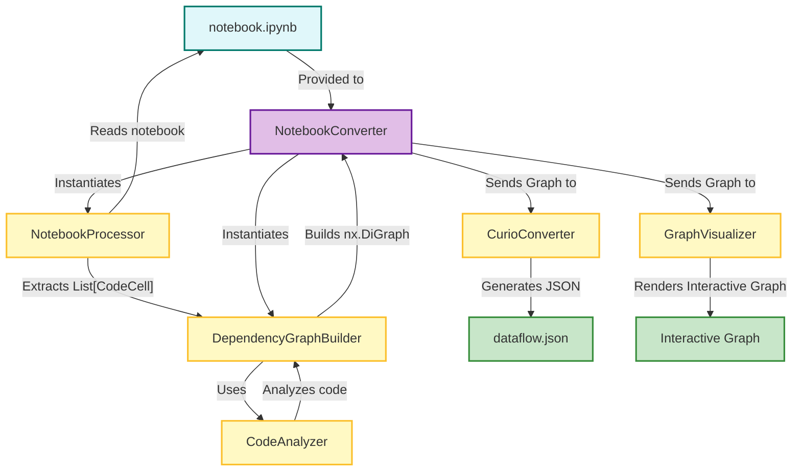

# nb2curio

```mermaid
graph TD
    %% User Input
    A[notebook.ipynb]:::input

    %% Processing Pipeline
    NC[NotebookConverter]:::main
    NP[NotebookProcessor]:::process
    CA[CodeAnalyzer]:::process
    DGB[DependencyGraphBuilder]:::process
    CC[CurioConverter]:::process
    GV[GraphVisualizer]:::process

    %% Outputs
    O1[dataflow.json]:::output
    O2[Interactive Graph]:::output

    %% Flow
    A -- "Provided to" --> NC

    NC -- "Instantiates" --> NP
    NP -- "Reads notebook" --> A
    NP -- "Extracts List[CodeCell]" --> DGB

    NC -- "Instantiates" --> DGB
    DGB -- "Uses" --> CA
    CA -- "Analyzes code" --> DGB
    DGB -- "Builds nx.DiGraph" --> NC

    NC -- "Sends Graph to" --> CC
    NC -- "Sends Graph to" --> GV

    CC -- "Generates JSON" --> O1
    GV -- "Renders Interactive Graph" --> O2

    %% Styling
    classDef input fill:#e0f7fa,stroke:#00796b,stroke-width:2px
    classDef main fill:#e1bee7,stroke:#6a1b9a,stroke-width:2px
    classDef process fill:#fff9c4,stroke:#fbc02d,stroke-width:2px
    classDef output fill:#c8e6c9,stroke:#388e3c,stroke-width:2px
```
