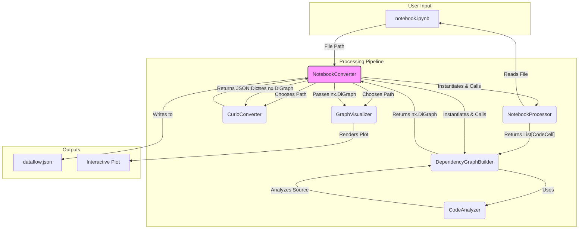

# nb2curio

```mermaid
graph TD;
    subgraph User Input
        A[notebook.ipynb]
    end

    subgraph Processing Pipeline
        NC(NotebookConverter)
        NP(NotebookProcessor)
        CA(CodeAnalyzer)
        DGB(DependencyGraphBuilder)
        CC(CurioConverter)
        GV(GraphVisualizer)
    end

    subgraph Outputs
        O1[dataflow.json]
        O2[Interactive Plot]
    end

    A -- File Path --> NC
    NC -- Instantiates & Calls --> NP
    NP -- Reads File --> A
    NP -- Returns List[CodeCell] --> DGB

    NC -- Instantiates & Calls --> DGB
    DGB -- Uses --> CA
    CA -- Analyzes Source --> DGB
    DGB -- Returns nx.DiGraph --> NC

    NC -- Chooses Path --> CC
    NC -- Chooses Path --> GV

    NC -- Passes nx.DiGraph --> CC
    CC -- Returns JSON Dict --> NC
    NC -- Writes to --> O1

    NC -- Passes nx.DiGraph --> GV
    GV -- Renders Plot --> O2

    style NC fill:#f9f,stroke:#333,stroke-width:2px
```
