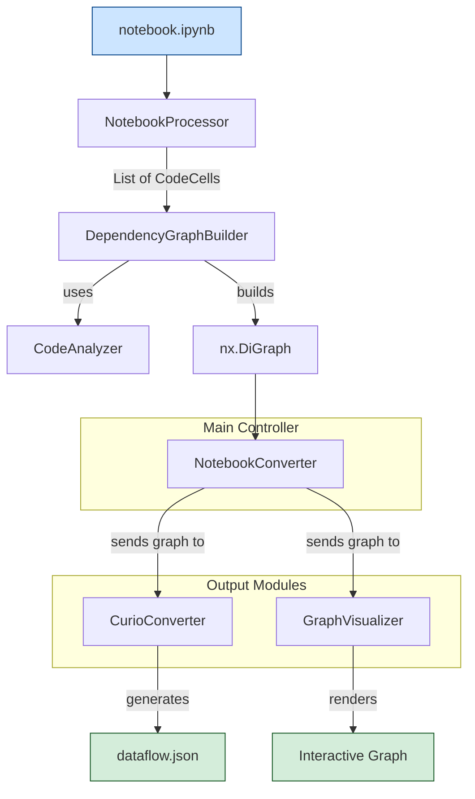

# Jupyter Notebook to Curio Converter (nb2curio)

**nb2curio** is a command-line utility that bridges the gap between exploratory data analysis in Jupyter Notebooks and structured, reproducible workflows. The program statically analyzes the Python code within a `.ipynb` file to infer a dependency graph between its cells. It solves the problem of translating the often non-linear and iterative process of notebook development into a formal, Directed Acyclic Graph (DAG) that can be visualized and converted directly into a [Curio](https://github.com/urban-toolkit/curio) dataflow JSON format.

-----

## Installation

As nb2curio is intended to be used with Curio, nb2curio requires Python >= 3.10 & < 3.12. Ensure you have the appropriate Python version and clone the repository.

1.  **Clone the repository:**
    ```bash
    git clone <your-repository-url>
    cd jupyter-to-curio
    ```
2.  **Install dependencies:**
    It is recommended to use a virtual environment.
    ```bash
    python -m venv .venv
    source .venv/bin/activate  # On Windows, use `\.venv\Scripts\activate`
    pip install -r requirements.txt
    ```

-----

## Usage

The tool can be run directly from the command line and has two primary modes: visualizing a notebook's dependency graph or converting it to a Curio-compatible JSON file.

### 1\. From the Command Line

This is the most direct method. From the project's root directory, run the tool as a module.

  * **To visualize a dependency graph:**
    ```bash
    python -m notebook_converter.main "path/to/your/notebook.ipynb" --visualize
    ```
  * **To convert to a Curio dataflow:**
    ```bash
    python -m notebook_converter.main "path/to/your/notebook.ipynb" -o "path/to/output.json"
    ```

### 2\. Import into Another Python Script

You can import the `NotebookConverter` class to integrate its functionality into a larger workflow.

```python
# In a separate script, e.g., run_conversion.py
from notebook_converter.main import NotebookConverter

converter = NotebookConverter("path/to/your/notebook.ipynb")

# Visualize the graph
print("Visualizing notebook...")
converter.visualize()

# Or, convert to Curio JSON
print("Converting to Curio JSON...")
converter.convert_to_curio("output/my_workflow.json")
```

### 3\. Interactive Python Session

Use the components interactively for debugging or experimentation.

```python
>>> from notebook_converter.main import NotebookConverter
>>> converter = NotebookConverter("path/to/your/notebook.ipynb")
>>> converter.visualize()
```

### Command-Line Arguments

| Argument/Flag | Alias | Description |
| :--- | :--- | :--- |
| `notebook_path` | | **(Required)** Path to the input Jupyter Notebook (`.ipynb`). |
| `--output` | `-o` | Path to save the output Curio JSON file. |
| `--visualize` | | If present, displays an interactive graph of the notebook's structure. |

-----

## How It Works: The Conversion Pipeline

The conversion process systematically deconstructs a notebook and rebuilds it as a structured dataflow.

1.  **Load & Extract**: The `.ipynb` file is loaded and all non-empty code cells are extracted.
2.  **Clean & Parse**: IPython magics (`%...`) and shell commands (`!...`) are stripped from each cell's code. The remaining Python is parsed into an Abstract Syntax Tree (AST).
3.  **Analyze Dependencies**: The AST for each cell is traversed to identify **defined variables** (e.g., `x = 10`) and **used variables** (e.g., `print(x)`).
4.  **Categorize Cells**: Based on keywords (e.g., `read_csv`, `plt.show`) and code structure, each cell is categorized as `imports`, `load_data`, `transform`, `visualize`, or `other`.
5.  **Build Graph**: A `networkx` directed graph is created where each cell is a node. An edge is drawn from **Cell A** to **Cell B** if a variable used in Cell B was last defined in Cell A.
6.  **Generate Output**:
      * **Visualization**: The graph is rendered visually using `matplotlib`. A hierarchical layout is used for valid DAGs.
      * **Curio JSON**: The graph is traversed, and each node and edge is converted into the corresponding JSON object required by the Curio schema.

-----

## Authoring Compatible Notebooks

To ensure a successful conversion, your notebook must be readable through static analysis.

  * ✅ **Do** group imports in dedicated cells at the top.
  * ✅ **Do** use separate cells for distinct logical steps (load, clean, visualize).
  * ✅ **Do** pass data between cells explicitly using variables.
  * ❌ **Don't** use wildcard imports (`from my_module import *`).
  * ❌ **Don't** rely on hidden state or modify global variables from functions.
  * ❌ **Don't** use IPython magics (`%run`) or shell commands (`!pip install`) for critical workflow logic, as they are ignored.

-----

## Architecture

This project uses a modular, class-based architecture to enforce a strong separation of concerns.

### Core Components

| Class | Description |
| :--- | :--- |
| `NotebookProcessor` | Loads and extracts code cells from the `.ipynb` file. |
| `CodeAnalyzer` | Parses cell code into an AST to find variable definitions, usages, and cell category. |
| `DependencyGraphBuilder` | Constructs a `networkx` graph representing the dataflow between cells. |
| `CurioConverter` | Translates the internal graph representation into the final Curio JSON format. |
| `GraphVisualizer` | Renders the dependency graph using `matplotlib` for interactive inspection. |
| `NotebookConverter` | The main controller class that orchestrates the entire workflow. |

### Component Interaction



-----

## Roadmap 🗺️

This project is under active development. Future enhancements we are planning include:

  * **Expanded Node Support**:

      * ⚛️ **Computation Analysis**: Add support for libraries like `SciPy` and `NumPy` to create dedicated computation nodes.
      * 🧊 **3D Visualization**: Integrate with libraries like `VTK` or `pyvista` to handle 3D visualization cells.
      * 🖼️ **Image Nodes**: Detect image processing libraries (`Pillow`, `OpenCV`) to create specific image input/output and manipulation nodes.
      * 🤖 **Machine Learning**: Add support for `scikit-learn` and `TensorFlow`/`PyTorch` to identify model training, evaluation, and prediction steps.

  * **Improved Dependency Analysis**:

      * 🪄 **Limited Magic Command Support**: Add parsing for common, safe magic commands like `%store` to track variables passed between notebooks.
      * 🎯 **Enhanced Error Reporting**: Provide more specific feedback, including line numbers and suggestions for fixing unparsable cells or broken dependencies.

  * **User Experience and Integration**:

      * 🏷️ **Cell Tagging**: Allow users to explicitly define a cell's category using notebook metadata tags (e.g., `{"tags": ["load_data"]}`) to override automatic detection.
      * ⚙️ **Configuration File**: Allow users to define custom keywords and rules for cell categorization in a `config.yaml` file.
      * 🖥️ **Web-based UI**: Develop a simple web interface for uploading notebooks and viewing the graph without using the command line.

-----

## Troubleshooting

| Scenario | Explanation & Solution |
| :--- | :--- |
| **`Error: The file '...' was not found.`** | The path to the notebook is incorrect. Double-check the path and ensure you are in the correct directory. |
| **`Warning: Could not parse a cell.`** | A cell contains a `SyntaxError`. The tool will skip this cell, which can break the dependency chain. Find and fix the syntax in your notebook. |
| **`Warning: Cycle detected.`** | Your notebook has a circular dependency (e.g., Cell 1 depends on Cell 2, which depends back on Cell 1). Refactor your notebook logic to ensure data flows in one direction. |
| **A dependency is missing in the graph.** | A dependency was likely created in a way the static analyzer can't detect (e.g., using `eval()` or IPython magics). Refactor the code to make the dependency explicit. |
