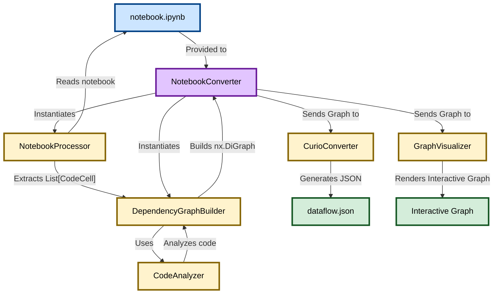

```mermaid
graph TD
    %% User Input
    A[notebook.ipynb]:::input

    %% Processing Pipeline
    NC[NotebookConverter]:::main
    NP[NotebookProcessor]:::process
    CA[CodeAnalyzer]:::process
    DGB[DependencyGraphBuilder]:::process
    CC[CurioConverter]:::process
    GV[GraphVisualizer]:::process

    %% Outputs
    O1[dataflow.json]:::output
    O2[Interactive Graph]:::output

    %% Flow
    A -- "Provided to" --> NC

    NC -- "Instantiates" --> NP
    NP -- "Reads notebook" --> A
    NP -- "Extracts List[CodeCell]" --> DGB

    NC -- "Instantiates" --> DGB
    DGB -- "Uses" --> CA
    CA -- "Analyzes code" --> DGB
    DGB -- "Builds nx.DiGraph" --> NC

    NC -- "Sends Graph to" --> CC
    NC -- "Sends Graph to" --> GV

    CC -- "Generates JSON" --> O1
    GV -- "Renders Interactive Graph" --> O2

    %% Styling
    classDef input fill:#cce5ff,stroke:#004085,color:#000,stroke-width:3px
    classDef main fill:#e2c5ff,stroke:#6a1b9a,color:#000,stroke-width:3px
    classDef process fill:#fff3cd,stroke:#856404,color:#000,stroke-width:3px
    classDef output fill:#d4edda,stroke:#155724,color:#000,stroke-width:3px
```
